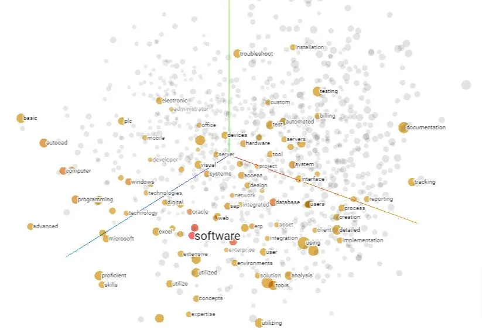

<style>
@import url('https://fonts.googleapis.com/css2?family=Prompt:ital,wght@0,100;0,300;0,400;0,700;1,100;1,300;1,400;1,700&display=swap');

    :root {
    font-family: Prompt;
    --hl-color: #D57E7E;
}
h1 {
  font-family: Prompt
}
</style>

# Information Technologies for Industrial Engineers

## เทคโนโลยีสารสนเทศสำหรับวิศวกรอุตสาหการ

---

# "Question and Answering" Application

---

# Natural Language Processing (NLP)

---

# What is NLP?

- A field of AI that makes human language intelligible to machines.
- NLP combines the power of linguistics and computer science to study the rules and structure of language.
- NLP creates intelligent systems capable of understanding, analyzing, and extracting meaning from text and speech.

---

# Aspect of language

- Syntax - ไวยากรณ์
- Semantics - ความหมาย
- Pragmatics - ความหมายในบริบท
- Morphology - การประกอบคำ

---

# How does it work?

- Text vectorization
  - Unsupervised learning
- NLP tasks
  - Supervised learning

---

# Text vectorization

- Known as "text embedding"
- Turn text/sentences into vectors.
- Need tons of data!
- Unsupervised learning



---

# NLP tasks (language analysis)

- Syntactic analysis
- Tokenization
- Part-of-speech tagging
- Dependency parsing
- Constituency parsing
- Lemmatization & stemming
- Word sense disambiguation
- Stopword removal

---

# NLP tasks (applications)

- Semantic Analysis
  - Classify text by polarity of opinion (positive, negative, neutral).
    Named Entity Recognition
- Named Entity Recognition (NER)
  - Extract entities from within a text (names, places, organizations, email addresses, etc).
- Text Classification
  - Classify text into predefined categories (tags).
- Answering questions

---

# "Question and Answer" model

- Pretrained BERT model

  - _Bidirectional Encoder Representations from Transformers_
  - Method of pre-training language representations which obtains state-of-the-art results on a wide array of Natural Language Processing tasks.

- Fine-tuned on [SQuAD 2.0 dataset](https://rajpurkar.github.io/SQuAD-explorer/).
  - Stanford Question Answering Dataset
  - Dataset consisting of articles from Wikipedia and a set of question-answer pairs for each article.

---

# Let's build an app.

---

# Setting up

- `npm install @tensorflow/tfjs @tensorflow-models/qna react-highlight-words`
- `npm install -D @types/react-highlight-words`
  - Type definition

---

`./src/model.ts`

```ts
import * as qna from "@tensorflow-models/qna";
import "@tensorflow/tfjs-backend-webgl";

export type Model = qna.QuestionAndAnswer;

export async function load_model() {
  // Load the model.
  try {
    const model = await qna.load();
    return model;
  } catch (err) {
    console.log(err);
    return null;
  }
}
```

---

# Initial information

- `./src/utils.ts`
  - https://gist.github.com/nnnpooh/344403f912b08c70925c4e405eef5e9f#file-model-ts
  - You can provide your own info.

---

# Main code

- `./src/App.tsx`
  - https://gist.github.com/nnnpooh/344403f912b08c70925c4e405eef5e9f#file-model-ts

---

# Testing

- Where is CMU?
- Where is CMU main campus?
- When did CMU open?
- What subject did CMU teach?
- What type of university CMU is?
- _What is the first higher education in northern Thailand?_

---

# Full version

---

- `./src/model.ts`

  - https://gist.github.com/nnnpooh/4ceaf25e25e382e2104ab66f486538d9#file-model-ts

- `./src/utils.ts`

  - https://gist.github.com/nnnpooh/4ceaf25e25e382e2104ab66f486538d9#file-utils-ts

- `./src/App.tsx`
  - https://gist.github.com/nnnpooh/4ceaf25e25e382e2104ab66f486538d9#file-app-tsx
