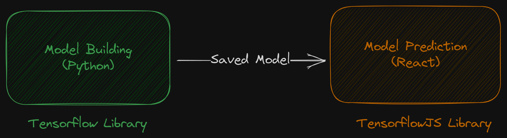
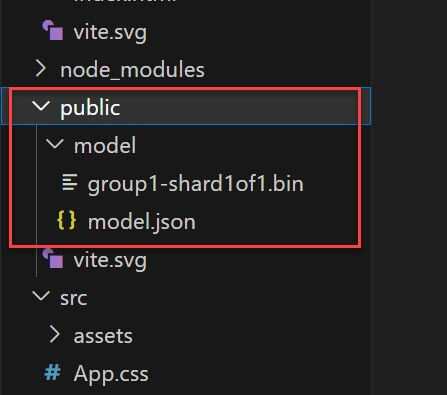

<style>
@import url('https://fonts.googleapis.com/css2?family=Prompt:ital,wght@0,100;0,300;0,400;0,700;1,100;1,300;1,400;1,700&display=swap');

    :root {
    font-family: Prompt;
    --hl-color: #D57E7E;
}
h1 {
  font-family: Prompt
}
</style>

# Information Technologies for Industrial Engineers

## เทคโนโลยีสารสนเทศสำหรับวิศวกรอุตสาหการ

---

# AI Application: Tensorflow JS

---



---

# Model building

---

# Google Colab

- https://colab.research.google.com/drive/13v4HuX0ejV9tLzYQfoytZR_KizRm6-D8?usp=sharing
- You should obtain the saved model (zip).

---

# Model prediction

---

# Setting up

- `npm create vite@latest`
- ...

---

# Library installation

- `npm install @tensorflow/tfjs @tensorflow/tfjs-converter`

---

# Model location

- Extract the zip file.
- Place the contents inside `./public/model` folder
  

---

`./src/model.ts`

```ts
// import "@tensorflow/tfjs-backend-cpu";
import "@tensorflow/tfjs-backend-webgl";
import { loadGraphModel } from "@tensorflow/tfjs-converter";

export async function load_model() {
  const MODEL_URL = "model/model.json";
  const model = await loadGraphModel(MODEL_URL);
  return model;
}
```

---

# `App.tsx`

https://gist.github.com/nnnpooh/0498cdc3578759d39ebf1461a7bce142#file-app-tsx
